<picture>
  <source media="(prefers-color-scheme: dark)" srcset="assets/banner-dark.svg">
  <source media="(prefers-color-scheme: light)" srcset="assets/banner-light.svg">
  
</picture>

  
  
  

## About me

I'm the **Founding Forward Deployed Engineer (engineer #3) at MoolAI**. I build the platform that takes enterprise AI agents from pilot to production with deterministic guardrails, and I deliver those agents for paying customers in EPM, healthcare and network security.

Before MoolAI I was a **Data Engineer at LTIMindtree**, running PySpark, Kafka and Databricks pipelines at the terabyte scale. I hold an **MS in Analytics from San Francisco State University**.

## Impact at a glance

| Before | After | How |
| :--- | :--- | :--- |
| 4-day EPM financial review | **30 minutes** | A hierarchical multi-agent system: a supervisor that plans and delegates to retrieval, anomaly-flagging and narrative sub-agents |
| 7-day logistics reconciliation | **1 day** | A multi-agent pipeline that replaced manual coordination across disconnected supply-chain systems |
| Manual security alert triage | **50% lower latency, 99.9% uptime** | A ReAct-style LangGraph + MCP system deployed in an air-gapped, on-prem environment (I led a team of 3) |
| Per-seat licenses for EPM, ERP and accounting tools | **Usage-based access from Slack and Teams** | Conversational agents in production at 3 enterprise customers |

## What I've built at MoolAI

- **Judge Council** *(provisional patent filed)*: a multi-stage LLM-as-a-judge evaluation pipeline. Judges score independently, then it calibrates across judges, corrects for verbosity bias and combines the results into a consensus. It runs in the Experiment Engine and against sampled production outputs.
- **ContextForge** *(provisional patent filed)*: a declarative RAG/CAG context-engineering engine. It compiles context in five phases, and when validation fails it feeds the schema and runtime errors back into the prompt so the agent can try again.
- **Agent deployment plane**: turns configured agents into signed artifacts and reproducible Terraform deployments. It works in customer-tenant Azure and MoolAI-managed Azure, gives one-click pilot-to-production promotion and keeps staging and prod infrastructure identical.

## Experience

**MoolAI** · Founding Forward Deployed Engineer · *San Francisco, CA · May 2025 – present*
Platform architecture and end-to-end enterprise delivery, from technical scoping after the sale through production go-live. I'm the technical point of contact for customer leadership.

**LTIMindtree** · Data Engineer · *Bengaluru, India · Aug 2021 – Apr 2023*
- Processed 2TB+ of IoT data daily with PySpark streaming, **cutting end-to-end latency by 40%**.
- Built Delta Lakehouse pipelines in Databricks that unified ERP and cloud data, **reducing ETL from 7 days to 2**.
- Built a PySpark + Kafka ingestion framework that auto-registered **10,000+ records per cycle** in Alation.
- Set up Azure DevOps CI/CD, **raising deployment frequency by 40%** with zero-downtime releases.

## Research project: FogBrain

**Decentralized edge LLM deployment for private GenAI** · *Graduate research, SFSU (advisor: Prof. Sameer Verma)*
Private LLM inference on a Raspberry Pi cluster using MicroK8s, Ollama and Distributed Llama. On-device RAG with no cloud dependency achieved **under 150 ms responses**, **35% lower latency** than the baseline and **25% lower power use**.

## Toolkit

**Languages**

**Agents & GenAI**

**Cloud & infrastructure**

**Backend & data**

**Enterprise integrations:** Slack API, Microsoft Teams API, Workday Adaptive Planning, Pigment, SAP, Salesforce, QuickBooks

## Education & certifications

- 🎓 **MS, Analytics**, San Francisco State University (2023 – 2025)
- 🎓 **BE, Computer Science**, Visvesvaraya Technological University (2017 – 2021)
- 📜 Google Professional Data Engineer · AWS Solutions Architect – Associate · Microsoft Technology Associate (Python)

---

Always happy to talk about agent architectures, LLM evaluation or getting GenAI into production. Reach out on <a href="https://www.linkedin.com/in/amoghranganathaiah">LinkedIn</a>.

